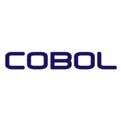

# cobol-buildpack



Cloud native buildpack for GnuCOBOL https://www.gnu.org/software/gnucobol

## Getting Started

Prerequisites

* [Docker](https://www.docker.com/)
* [Pack](https://buildpacks.io/docs/install-pack/)

Make sure you have docker and pack running:
```
$ docker run hello-world
$ pack --version
```
Grab some sample cobol and set a builder that uses this cobol-buildpack:
``` 
git clone https://github.com/dashaun/cobol-hello-world
cd cobol-hello-world
pack set-default-builder dashaun/cnb-buildpack:bionic
pack build helloworld --path ./
docker run -it helloworld
```
You just compiled cobol using a cloud native buildpack, and created a docker image to run the cobol!

## Package the buildpack

``` 
$ pack package-buildpack dashaun/cobol-buildpack --package-config package/package.toml
Successfully created package dashaun/cobol-buildpack
$
```

## Publish the buildpack

``` 
$ pack package-buildpack dashaun/cobol-buildpack --package-config package/package.toml --publish
Successfully published package dashaun/cobol-buildpack
$
```

## Version

On Docker Hub [dashaun/cobol-buildpack](https://hub.docker.com/r/dashaun/cobol-buildpack)

Currently supports GnuCOBOL version 3.1-dev

### Additional Resources

* [`pack create-builders` documentation](https://buildpacks.io/docs/using-pack/working-with-builders/)
* https://buildpacks.io/docs/buildpack-author-guide/create-buildpack/
* https://github.com/ayumin/heroku-buildpack-cobol
* https://open-cobol.sourceforge.io/
